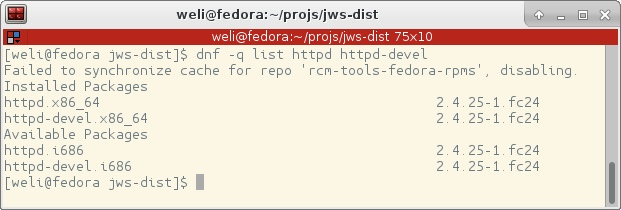
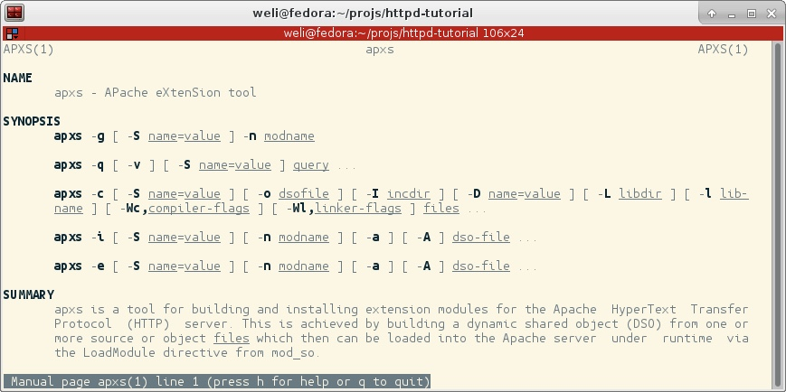
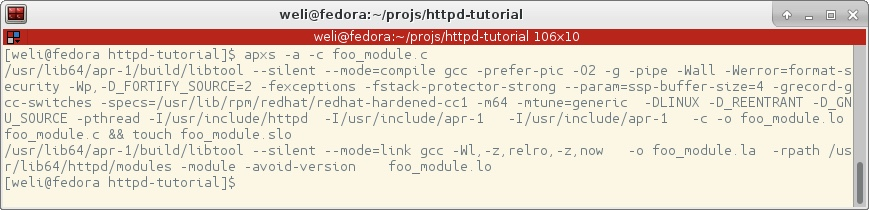

# Write An Apache HTTPD Module

In this article I'd like to show you how to write a module for `Apache HTTPD`. I'm using `Fedora Linux`, So I can use the `httpd` and `httpd-devel` provided by system:



The reason to install `httpd-devel` is that we need the header files relative to module deveplopment provided by it. Now let's write a simple module:

```c
// module_foo.c
#include <stdio.h>
#include "apr_hash.h"
#include "ap_config.h"
#include "ap_provider.h"
#include "httpd.h"
#include "http_core.h"
#include "http_config.h"
#include "http_log.h"
#include "http_protocol.h"
#include "http_request.h"


static int foo_handler(request_rec *r) {
  if (!r->handler || strcmp(r->handler, "foo_handler")) return (DECLINED);

  ap_set_content_type(r, "text/html");
  ap_rprintf(r, "Hello, martian!");

  return OK;
}

static void foo_hooks(apr_pool_t *pool) {
  ap_hook_handler(foo_handler, NULL, NULL, APR_HOOK_MIDDLE);
}

module AP_MODULE_DECLARE_DATA foo_module = {
  STANDARD20_MODULE_STUFF,
  NULL,
  NULL,
  NULL,
  NULL,
  NULL,
  foo_hooks
};
```

This module will use `AP_MODULE_DECLARE_DATA` to register a `foo_module`：

```c
module AP_MODULE_DECLARE_DATA foo_module = ...
```

And it will use `foo_hooks` to call `ap_hook_handler`, and `ap_hook_handler` will load our `foo_handler` into `httpd`：

```c
static void foo_hooks(apr_pool_t *pool) {
  ap_hook_handler(foo_handler, NULL, NULL, APR_HOOK_MIDDLE);
}
```

Our main function `foo_handler` is very simple. You can see it doesn't deal with `request_rec`. It will just output some HTML data：

```c
ap_set_content_type(r, "text/html");
ap_rprintf(r, "Hello, martian!");
```

As we have understood the meaning of this simple module, now we can compile it. `Apache HTTPD` has provided a module compiling and installing tool for us called `apxs`:



We can use it to compile our `foo_module`:



As the snapshot shown above，we have used `apxs` to compile `foo_module.c`:

```bash
$ apxs -a -c foo_module.c
```

The output of compling process is like this:

```bash
/usr/lib64/apr-1/build/libtool --silent --mode=compile gcc -prefer-pic -O2 -g -pipe -Wall -Werror=format-security -Wp,-D_FORTIFY_SOURCE=2 -fexceptions -fstack-protector-strong --param=ssp-buffer-size=4 -grecord-gcc-switches -specs=/usr/lib/rpm/redhat/redhat-hardened-cc1 -m64 -mtune=generic  -DLINUX -D_REENTRANT -D_GNU_SOURCE -pthread -I/usr/include/httpd  -I/usr/include/apr-1   -I/usr/include/apr-1   -c -o foo_module.lo foo_module.c && touch foo_module.slo
/usr/lib64/apr-1/build/libtool --silent --mode=link gcc -Wl,-z,relro,-z,now   -o foo_module.la  -rpath /usr/lib64/httpd/modules -module -avoid-version    foo_module.lo
```

As the output shown above, we can see `apxs` used `libtool` to compile our module, and generated many files:

```bash
$ ls
foo_module.c  foo_module.la  foo_module.lo  foo_module.o  foo_module.slo
```

There are also generated files in `.libs` directory：

```bash
$ ls -l ./.libs/
total 104
-rw-rw-r--. 1 weli weli 35580 Jan 27 02:55 foo_module.a
lrwxrwxrwx. 1 weli weli    16 Jan 27 02:55 foo_module.la -> ../foo_module.la
-rw-rw-r--. 1 weli weli   938 Jan 27 02:55 foo_module.lai
-rw-rw-r--. 1 weli weli 35432 Jan 27 02:55 foo_module.o
-rwxrwxr-x. 1 weli weli 25560 Jan 27 02:55 foo_module.so
```

Most of the files on above are intermediate libraries genereated during compile process, what we care is the shared library, which is `.so` file. This is the module file that can be loaded by Apache HTTPD.

Nevertheless, we don't have to install the module manually, we can also use the `apxs` utility to install it to default `httpd` installation location. Here is the command to install the module:


```bash
$ sudo apxs -i foo_module.la
```

Please note we have used `sudo` to invoke `apxs`, because the module will be installed to system provided `httpd`, and its directories need root permission to modify. In addition, the `foo_module.la` is a `libtool` description file that describes the libraies it generated, and it is a pure text file if you'd like to check. Here is the output of above command:

```bash
/usr/lib64/httpd/build/instdso.sh SH_LIBTOOL='/usr/lib64/apr-1/build/libtool' foo_module.la /usr/lib64/httpd/modules
/usr/lib64/apr-1/build/libtool --mode=install install foo_module.la /usr/lib64/httpd/modules/
libtool: install: install .libs/foo_module.so /usr/lib64/httpd/modules/foo_module.so
libtool: install: install .libs/foo_module.lai /usr/lib64/httpd/modules/foo_module.la
libtool: install: install .libs/foo_module.a /usr/lib64/httpd/modules/foo_module.a
libtool: install: chmod 644 /usr/lib64/httpd/modules/foo_module.a
libtool: install: ranlib /usr/lib64/httpd/modules/foo_module.a
libtool: finish: PATH="/sbin:/bin:/usr/sbin:/usr/bin:/sbin" ldconfig -n /usr/lib64/httpd/modules
----------------------------------------------------------------------
Libraries have been installed in:
   /usr/lib64/httpd/modules

If you ever happen to want to link against installed libraries
in a given directory, LIBDIR, you must either use libtool, and
specify the full pathname of the library, or use the '-LLIBDIR'
flag during linking and do at least one of the following:
   - add LIBDIR to the 'LD_LIBRARY_PATH' environment variable
     during execution
   - add LIBDIR to the 'LD_RUN_PATH' environment variable
     during linking
   - use the '-Wl,-rpath -Wl,LIBDIR' linker flag
   - have your system administrator add LIBDIR to '/etc/ld.so.conf'

See any operating system documentation about shared libraries for
more information, such as the ld(1) and ld.so(8) manual pages.
----------------------------------------------------------------------
chmod 755 /usr/lib64/httpd/modules/foo_module.so

```

The important line is at the bottom of above log, from which we can see `foo_module.so` is installed to the default installation location of Fedora Linux provided `httpd`.

The above `apxs` command will just install the `.so` file into httpd module directory, but it won't load it in `httpd` config file for you. If you'd like to activate your module by adding it into `httpd` config file, you can use the following command:

```bash
$ sudo apxs -ia foo_module.la
```

And this time there is an additional line in the output:


```bash
chmod 755 /usr/lib64/httpd/modules/foo_module.so
[activating module 'foo' in /etc/httpd/conf/httpd.conf]
```

As the log shown above, we can see `foo` module is added into `/etc/httpd/conf/httpd.conf`, and we can check it:

```conf
$ grep foo /etc/httpd/conf/httpd.conf
# LoadModule foo_module modules/mod_foo.so
LoadModule foo_module         /usr/lib64/httpd/modules/foo_module.so
```


